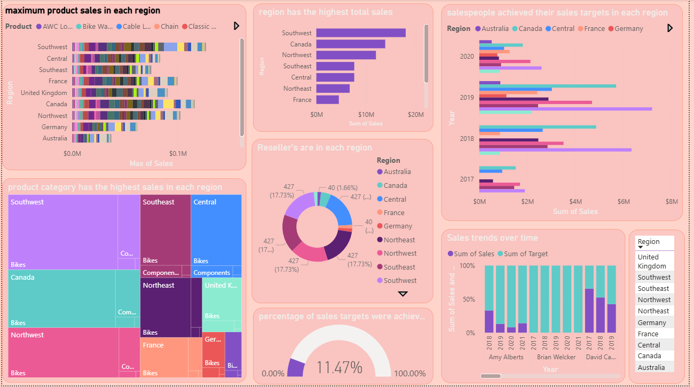

# Sales Performance Dashboard
### Regional Sales Analysis & Target Achievement — Power BI

---

## Business Problem

Sales leadership needs to monitor performance across multiple regions simultaneously — tracking not just revenue, but whether salespeople are hitting their targets and which product categories are driving growth.

This dashboard answers **7 critical business questions** in a single interactive report.

---

## Dashboard Preview



---

## Business Questions Answered

| # | Question |
|---|----------|
| 1 | What is the maximum product sales in each region? |
| 2 | Which product category has the highest sales in each region? |
| 3 | Which region has the highest total sales? |
| 4 | How many resellers are in each region? |
| 5 | Which salespeople achieved their targets in each region? |
| 6 | What are the sales trends over time? |
| 7 | What percentage of sales targets were achieved overall? |

---

## Dashboard Visuals

| Visual | Type | Insight |
|--------|------|---------|
| Maximum product sales by region | Stacked Bar Chart | Compares top-selling products across all regions |
| Product category by region | Treemap | Shows category dominance per region at a glance |
| Total sales by region | Horizontal Bar Chart | Southwest leads with $20M+ in total sales |
| Resellers per region | Donut Chart | Equal distribution — 427 resellers per region (17.73% each) |
| Salesperson target achievement | Bar Chart by Year | Tracks individual performance from 2017 to 2020 |
| Sales vs Target trend | Stacked Bar Chart | Shows gap between actual sales and targets over time |
| Target achievement % | Gauge Chart | Overall achievement rate: **11.47%** |

---

## Key Findings

| Finding | Insight |
|---------|---------|
| Southwest leads in total sales | Consistently the highest-revenue region across all years |
| Bikes dominate all regions | Top-selling category in every region — drives the majority of revenue |
| Target achievement is 11.47% | Significant gap between sales targets and actual performance — targets may need recalibration |
| Equal reseller distribution | 427 resellers per region suggests a balanced but potentially saturated distribution network |
| Sales growth visible 2017–2020 | Upward trend in actual sales despite low target achievement rate |

---

## Tools Used

| Tool | Usage |
|------|-------|
| Power BI Desktop | Dashboard design and interactivity |
| DAX | Calculated measures for targets and achievement % |
| Interactive Slicer | Region filter for drill-down analysis |

---

## Project Structure

```
Project-Sales-BI-/
│
├── Project Sales.pbix    <- Power BI dashboard file
├── Report.png            <- Dashboard screenshot
└── README.md
```

---

## How to Open

1. Download and install [Power BI Desktop](https://powerbi.microsoft.com/desktop/) (free)
2. Clone or download this repository
3. Open `Project Sales.pbix` in Power BI Desktop
4. Use the Region slicer to filter by specific regions

---

*Analysis by **Rania Mofeed** | [LinkedIn](https://www.linkedin.com/in/raniamofeed) | [GitHub](https://github.com/RaniaMofeed)*
